# HCM4A Mobile Service - Compilation Guide

This guide walks you through setting up the **Ultimate++ (UPP)** development environment and compiling the `DLL_Mobile.dll` library and the `HCM4AMobileService.exe` application using *TheIDE*.

## 1. Installing UPP

### 1.1 Download UPP
Download the UPP archive from [https://sourceforge.net/projects/upp/](https://sourceforge.net/projects/upp/).

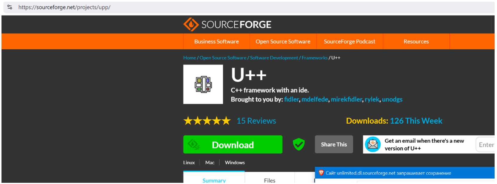

### 1.2 Unpack UPP Archive
Unpack the `upp-archive` to any location on your hard drive, but placement as a root folder is recommended (e.g., `C:\upp`).

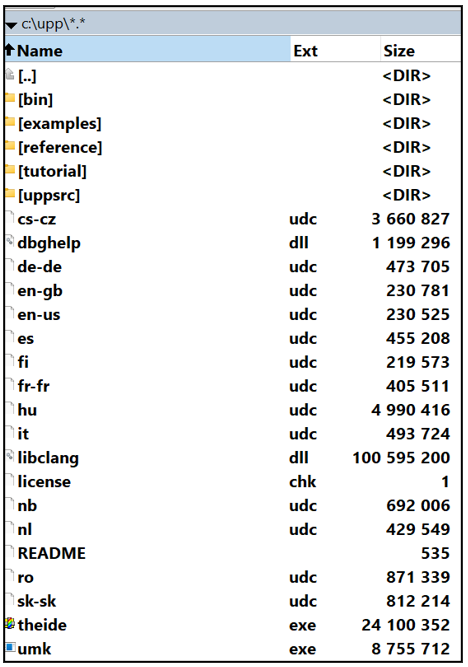

### 1.3 Start TheIDE
Start the `theide.exe` file in the UPP folder. Agree to execute if Windows Defender requests permission to execute a file from an unknown source. This will prompt a copyright dialog:

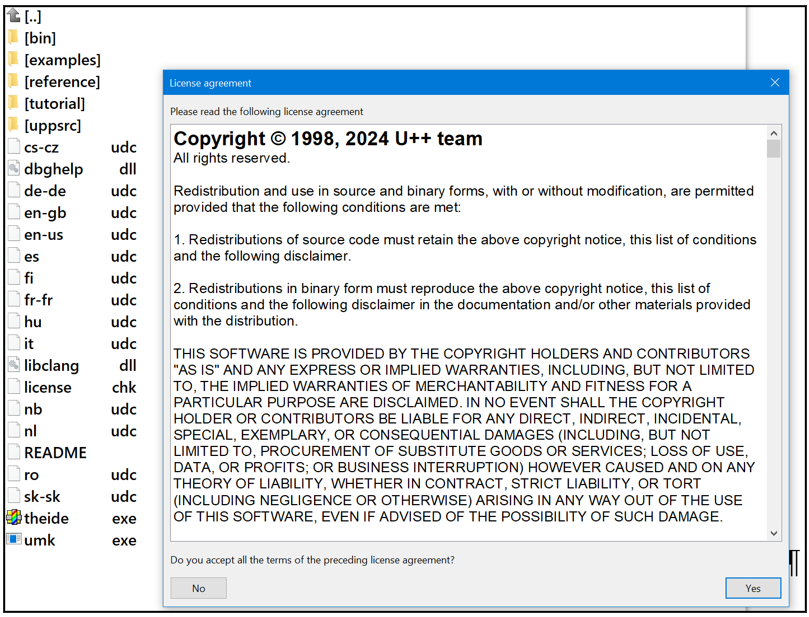

### 1.4 Accept Copyright and Initialize
Press «Yes» and wait until the initiation of UPP is complete. This will result in the following dialog window appearing. Press “Cancel”:

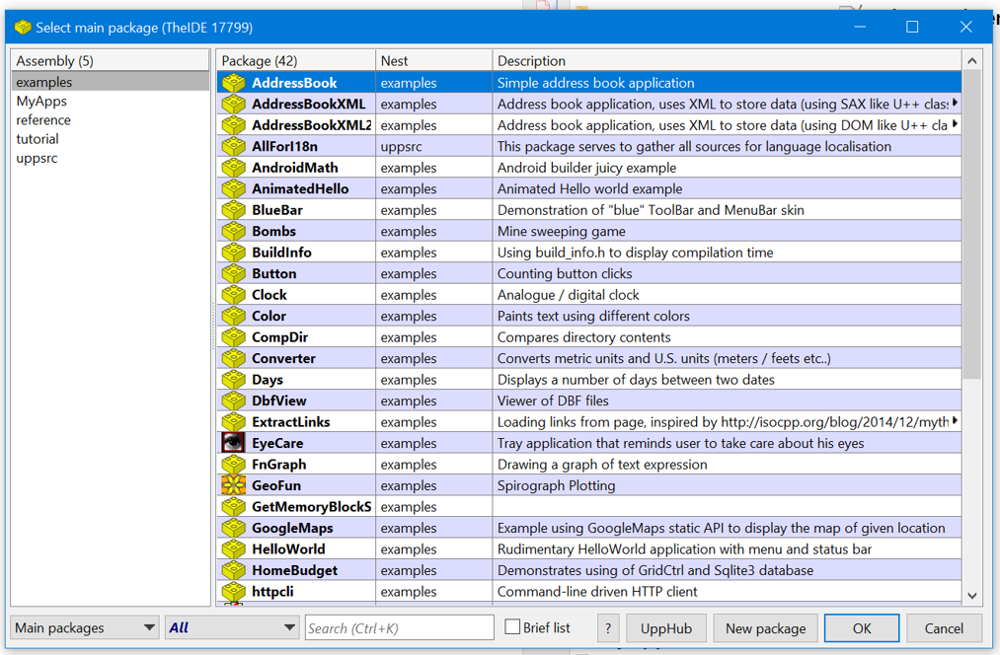

### 1.5 Complete UPP Setup
Pressing “Cancel” will close the UPP software and complete all preparations for further compilation of the software.

## 2. Compiling `DLL_Mobile.dll`

### 2.1 Create Project Directory
Inside the UPP folder, create a new folder `MyApps`, followed by an embedded folder `DLL_Mobile`. Place the DLL library source code in that final folder:

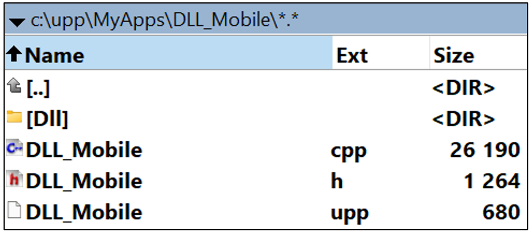

### 2.2 Open Project in TheIDE
To compile (build) the DLL-file, start `theide.exe`, select the assembly from the `MyApps` folder for `DLL_Mobile.dll`, and press the OK button to open this project:

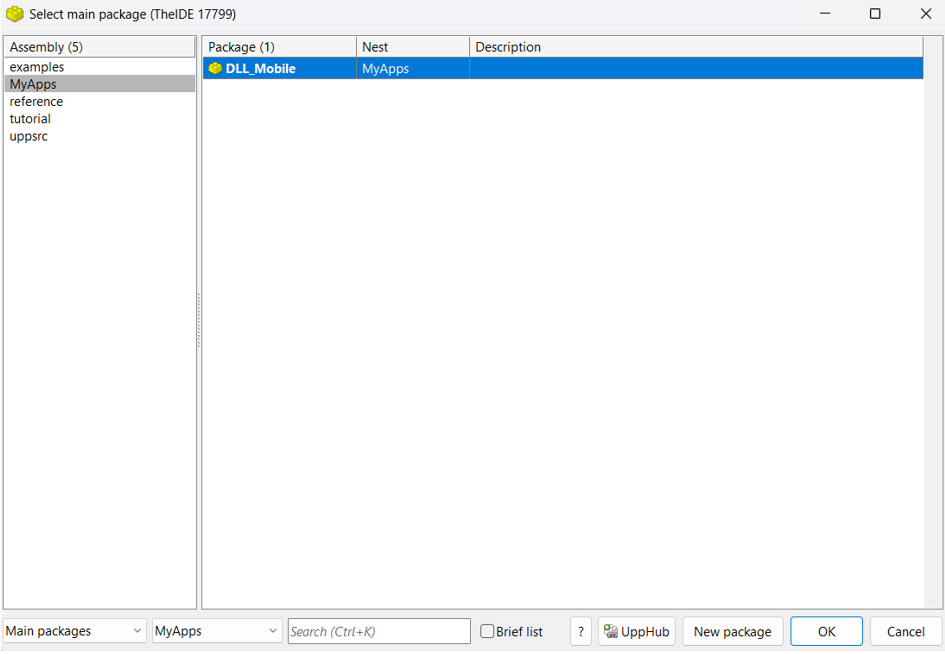

### 2.3 Build DLL
In the interface of the UPP framework, open the “Build” menu and press the “Build” command.

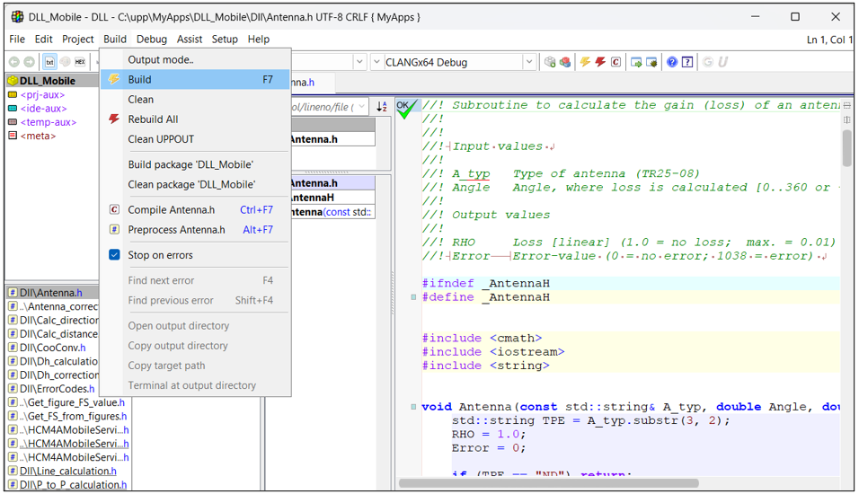

### 2.4 Monitor Compilation
After a few seconds, the DLL-file will be compiled. An IDE-console string will show up at the bottom of the window to indicate progress and, finally, the folder with the output:

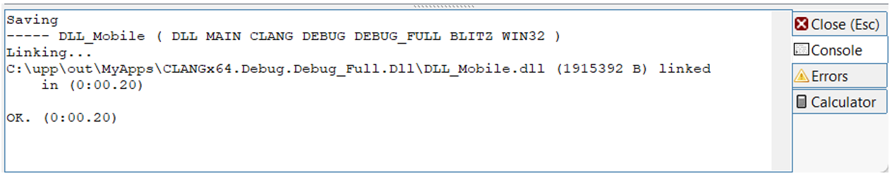

### 2.5 Finalize DLL Compilation
Close the UPP-framework program. The `DLL_Mobile.dll` file is compiled and can be used further with the `HCM4AMobileService` program (only the DLL-file is needed for further work).

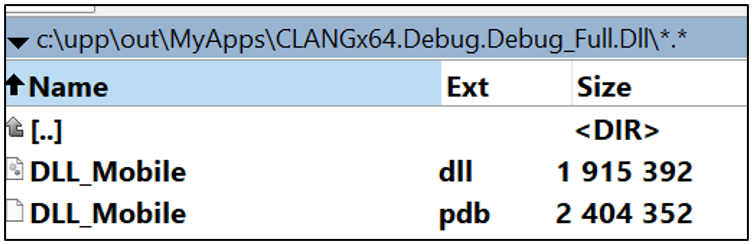

## 3. Compiling `HCM4AMobileService.exe`

### 3.1 Create GUI Project Directory
Similar to step 2.1 above, create a folder inside `MyApps` to place the source code of the GUI program (e.g., `c:\upp\MyApps\HCM4AMobileService\`). Place the GUI source code in that final folder:

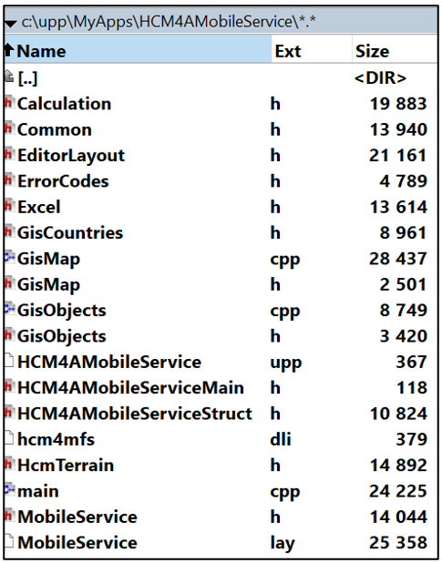

### 3.2 Open GUI Project in TheIDE
To compile (build) `HCM4AMobileService`, start `theide.exe`, select the assembly from the `MyApps` folder for `HCM4AMobileService`, and press the OK button to open this project:

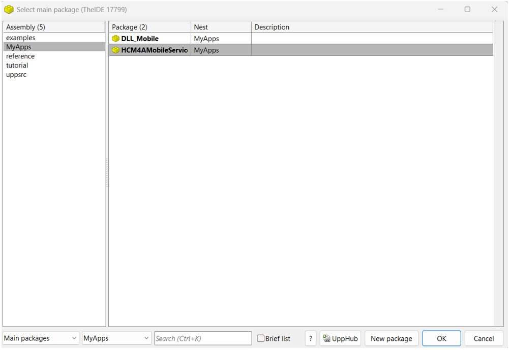

### 3.3 Initial Compilation Attempt (Expected Failure)
The first attempt to compile the HCM4A mobile service GUI will likely fail due to a lack of additional UPP components not present in the general installation.

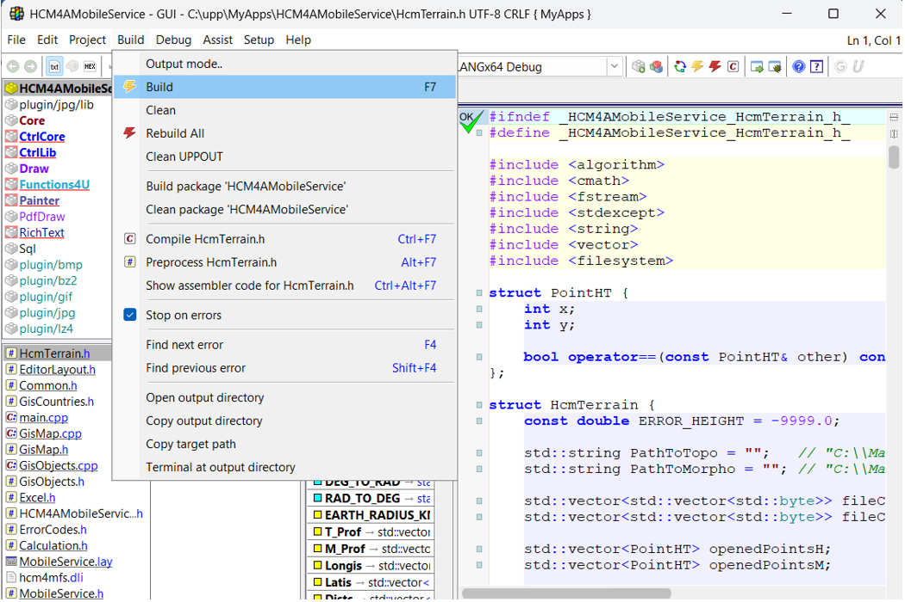
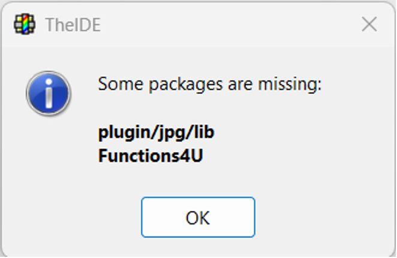

### 3.4 Install Functions4U Unit
The `Functions4U` unit needs to be installed. Missing `plugin/jpg/lib` can be ignored as it will be automatically linked by the UPP framework GUI without any additional actions from the user. To install the `Functions4U` unit, go to the Setup menu and switch to UPP hub:

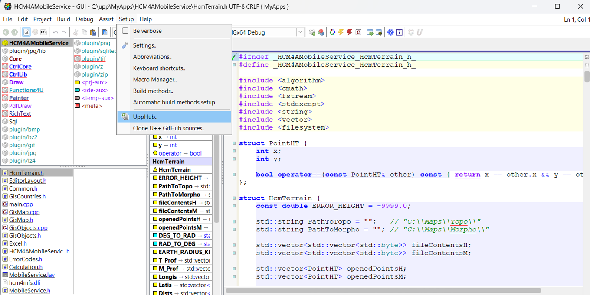

### 3.5 Search and Install Functions4U
At the bottom of the UPP Hub window, enter “FUNCTIONS4U” to automatically search for the missing unit. Then select and install that unit:

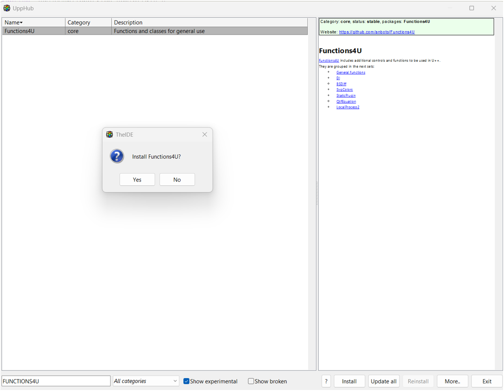

This will trigger an installation progress window:

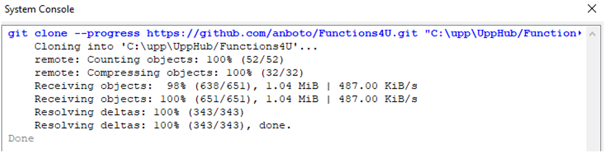

### 3.6 Retry GUI Compilation
Repeat the attempt to compile the HCM4A mobile service GUI. In the interface of the UPP framework, open the “Build” menu and press the “Build” command. Ignore missing `plugin/jpg/lib` if you are reopening the `MyApps` project.

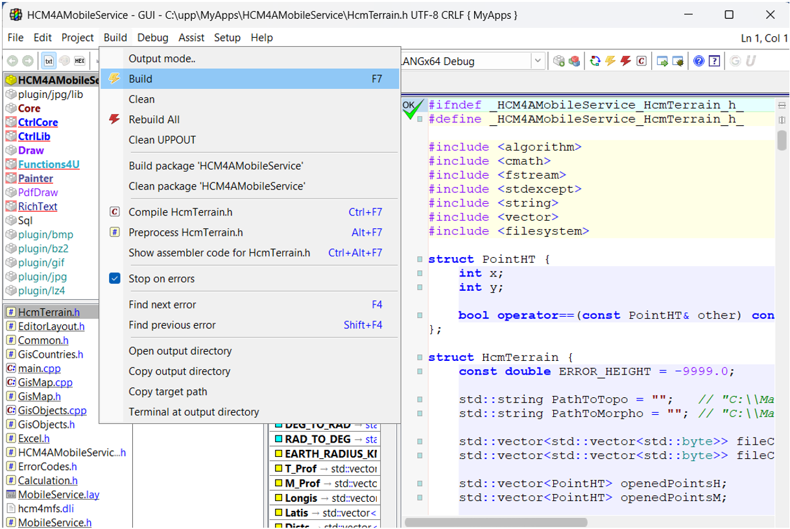

### 3.7 Monitor GUI Compilation
After a few minutes, `HCM4AMobileService.exe` will be compiled. An IDE-console string will show up at the bottom of the window to indicate progress and, finally, the folder with the output. Ignore warnings at the end of the compilation process (warnings do not affect proper compilation) and switch to the console to see the output file:

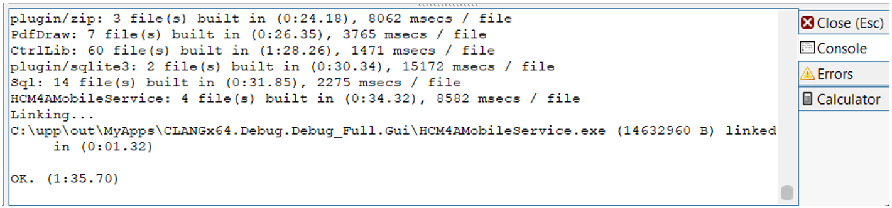

### 3.8 Finalize GUI Compilation
Close the UPP-framework program. The `HCM4AMobileService.exe` file is compiled and can be used further with the DLL-library (only the EXE-file output is needed for further work).

## 4. Combining into the Final Software

### 4.1 Place DLL and EXE Files
Place the DLL-file and EXE-file in a new folder (e.g., `C:\HCM4AMobileService\`).

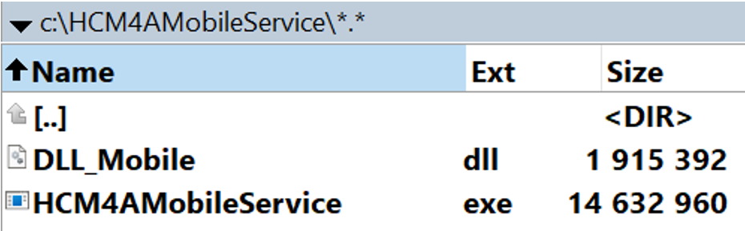

### 4.2 Create "Files" Folder
Create a new folder `Files` inside the `HCM4AMobileService` folder.

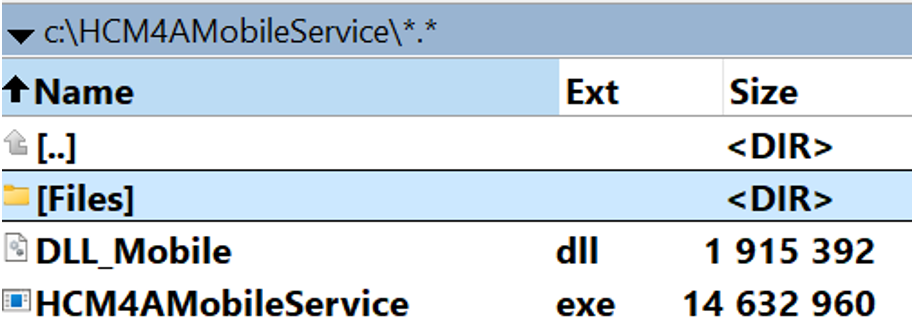

### 4.3 Create `ListOfCountries.txt`
Inside the `Files` folder, create a text file named `ListOfCountries.txt` and copy the following contents into this file. This file is used to link country maps and the GUI and can be used to add new countries in the future without recompilation of the GUI.

```text
AFS
ZA1
AGL
AO1
ALG
BDI
BEN
BFA
BOT
CAF
CME
COD
COG
COM
CPV
CTI
DJI
EGY
ERI
ETH
GAB
GHA
GMB
GNB
GNE
GQ1
GUI
KEN
LBR
LBY
LSO
MAU
MDG
MLI
MOZ
MRC
MTN
MWI
NGR
NIG
NMB
RRW
SDN
SEN
SEY
SOM
SRL
SSD
STP
SWZ
TCD
TGO
TUN
TZA
TZ1
UGA
ZMB
ZWE
```

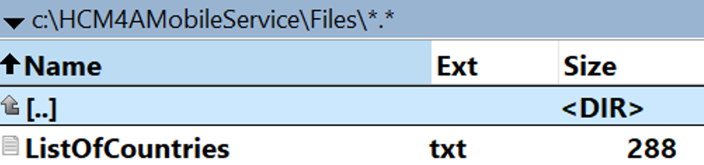

### 4.4 Create “Stations”, “RefList” and “TestList” folders
Final step includes creating a number of other folders inside “HCM4AMobileService” folder (or any other name for main folder at user’s choice). First create a new folder “Stations” inside “HCM4AMobileService” folder

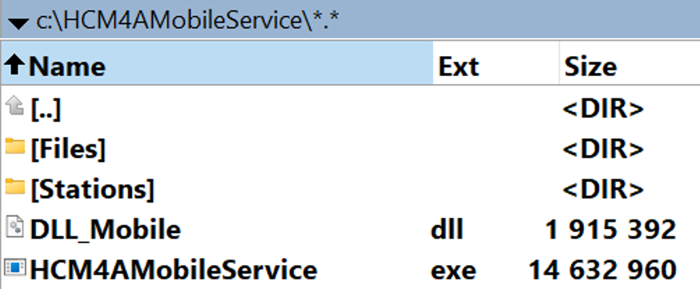
 
And then create to subfolders “RefList” and “TestList”
 
### 4.5 Starting the program
The program is ready to start. The first action after the start would be to download mapping data and provide path for it in “Paths” menu:

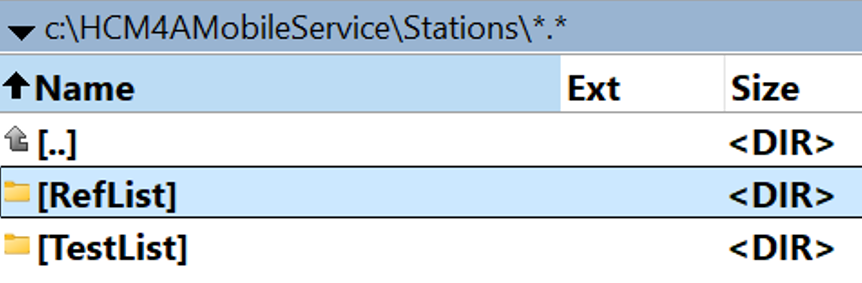
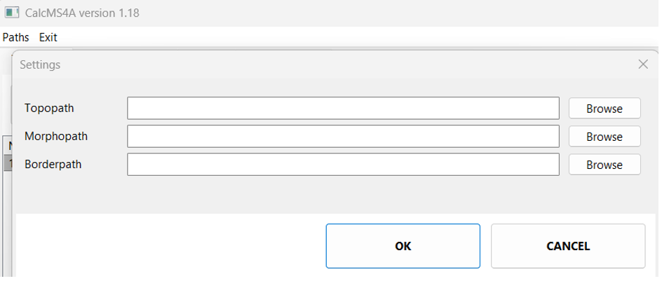
