# Graphical User Interface Guide for Mobile Service

## 1. General Information

### 1.1 General Description
This harmonized calculation method for the mobile service is part of the HCM4A Agreement. The GUI program, empowered by the calculation library (DLL) provides means to assess interference between mobile stations in a point-to-point manner (relevant mostly to PMR/PAMR networks), calculate interference into neighboring countries at cross-border range locations (also usually applied to PMR/PAMR networks) and along x-km lines equidistant from the border (usually applied to cellular systems). All calculations are done based on the stations descriptions in the file format following Annex 2A of the Agreement.

HCM4A software for mobile service consists of two parts – the calculation library (hcm4ams.dll) and the program (HCM4AMobileService). The implementation of both reuses many elements from the similar software developed for the HCM Agreement in Europe, but implemented independently for the HCM4A Agreement. All calculations are being made in the calculation library. HCM4AMobileService does not make calculations by itself; instead, it uses the library for calculations. The GUI program just performs sequential calls of the library main subroutines to get results for multiple stations. This document serves as a user’s guide to the GUI program. Although the HCM4A software is developed for Microsoft Windows operating system, it may also be compiled for Linux or MacOS. In case calculation result for Microsoft Windows would differ from the version for other OS, version of the HCM4A for mobile service for Windows OS should be used as the reference.

### 1.2 General note
In this description (unless stated differently):
- all angles are in degrees,
- all heights are in meters,
- all distances are in kilometers.

## 2. HCM4A Calculation Program for Mobile Service (HCM4AMobileService)

HCM4AMobileService is created to help Administrations perform interference calculations according to the HCM4A Agreement. In addition to that main purpose, it allows creating, editing, checking, and comparing HCM4A formatted files.
The program is cross-platform. Although the main platform for compilation is Windows, it may also be compiled for Linux and MacOS. The program is created using C++ language and U++ framework.

### 2.1 Interference Calculations
HCM4AMobileService performs three types of interference calculations:
- **Point to point calculations**. In this case user has to provide HCM4AMobileService with two files. One has to be uploaded as the test list of stations, another – has to be uploaded as the list of reference stations. This mode calculates interference from Tx or TRx in the test list into receivers in the reference list (Rx or TRx). It could be used also for single case calculations (one Tx in the test list and one Rx in the reference list).
- **Cross-border range calculations**. In this case user has to provide HCM4AMobileService with a file as a test list of stations (Tx or TRx more specifically, Rx parts currently are not replaced by equivalent Tx and ignored). The calculation also requires the user to specify the country to which interference will be calculated (the originating country is assumed in Tx station records) and to specify cross-border range distance (depth of interference into another country along radius from Tx station).
- **X-line calculations**. In this case user has to provide HCM4AMobileService with a file as a test list of stations (Tx or TRx more specifically, Rx are ignored in this mode). The calculation also requires the user to specify the country to which interference will be calculated (the originating country is assumed in Tx station records) and to specify the x-km equidistant line from the border inside another country (including 0-km line, e.g. border itself).

Before performing calculations, you need to set appropriate paths required by HCM4AMobileService calculation library (hcm4ams.dll). See section on setting up path further in the document.

#### 2.1.1 Point to point calculations
Point to point calculations perform analysis of one file entries against another. Each file is uploaded in the relevant tab. The software has four tabs, two of which are named “Test list” and “Reference list” accordingly. Each tab has its own “Open” button to upload the file formatted in accordance with Annex 2B of the Agreement. It should be noted that the GUI retains the last opened files in the program after exiting, therefore stations could be already in place at the next start of the GUI program. See more on opening and editing files in the dedicated section further down in the document. The example of uploaded stations is shown below, corresponding to PMR repeaters (base stations).

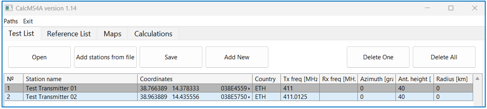
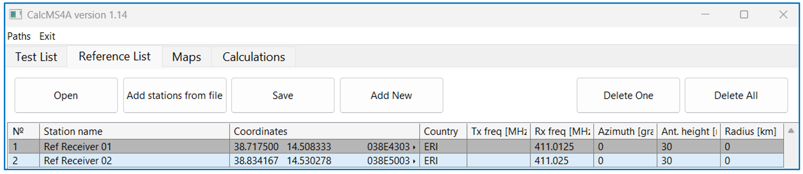

The results of the upload of relevant stations could be observed on the “Maps” tab, which also automatically upload existing borders on the map (files with .ALL extensions from BORDER folder, see details below). The map also shows radius of service area as a circle for mobile station(radius>0) or azimuth, if station is fixed.

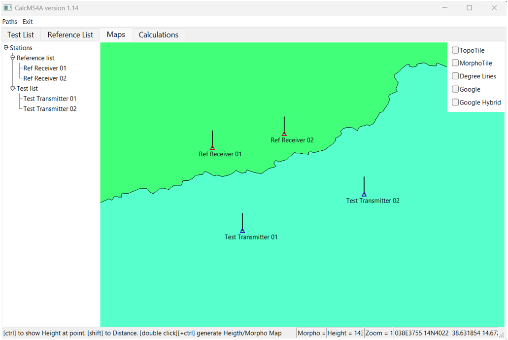

After the upload of stations is finished and the result is observed on the map, the calculation is done from the Calculations tab. This tab has control elements to initiate calculation for point-to-point calculation type (as well as for other types).

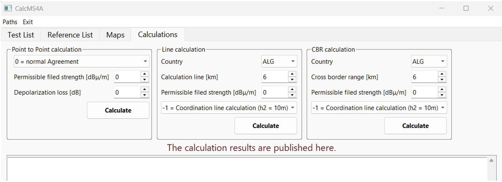

For point-to-point calculations, one should select one of four modes of calculations:
- 0: P2P (normal HCM Agreement) with t%=1 or 10, depending on Tx channel occupancy;
- +10: P2P with t% = 10
- +11: P2P with t% = 50
- +12: P2P with t% = 1

Besides mode of calculation, it is necessary to specify base permissible field strength (based on Annex 1 of the Agreement or stated from any other agreement) and depolarization loss. Taking into account the depolarization loss is optional and should be agreed for individual coordination requests on a bilateral basis.
The calculation results are then presented in the same tab. Note that permissible FS is adjusted in point-to-point calculations taking into account spectrum masks and antenna pattern of Rx for each particular pair.
After pressing the “Calculate” button in the Point to Point section, the result is shown in the tab in a concise manner with major inputs and outputs.

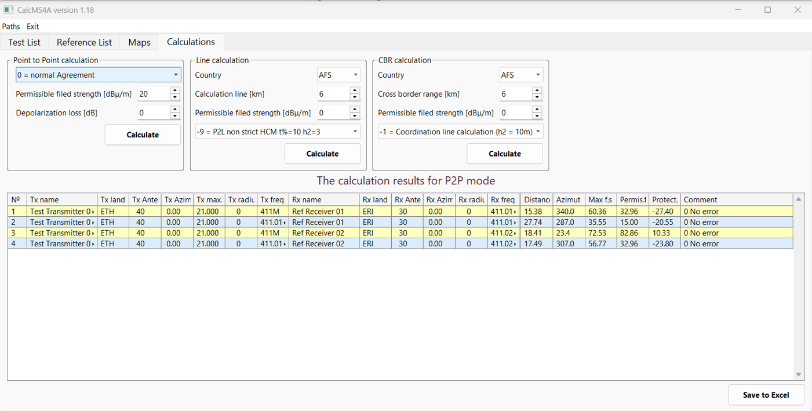

Furthermore, there is “Save to Excel” button on the bottom of the Calculations tab to save overall result to .xls file.

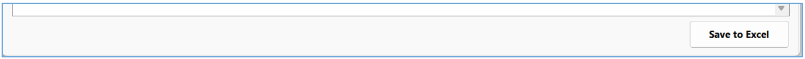

For Point to point calculations, field strength of the interference and the permissible threshold are adjusted based frequency separation and other corrections. For more details each line of the table with results could be clicked to open detailed log for this particular point-to-point case in the form of separate txt file as shown below.

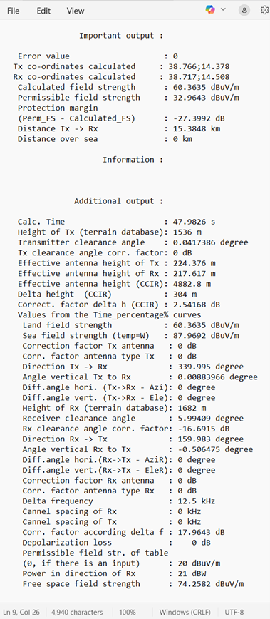

#### 2.1.2 Line calculations
Line calculation perform analysis of Tx entries in the test list only, ignoring Rx in this list or any records uploaded in the reference list tab. This mode is mostly used to check interference from cellular networks in accordance with complimentary bilateral or multilateral agreements (outside the HCM4A Agreement).

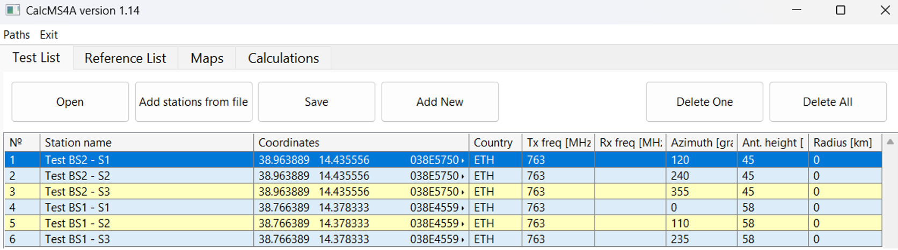

For line calculations one should provide the country to which interference is directed and assessed as well as the x-km distance to select a line from existing preset (6, 9, 15 km and etc.) together with the permissible FS (for example from ECC recommendations or bilateral/multilateral agreements). It should be noted that no corrections are automatically provided to the permissible FS for line calculations. Finally, one should select an appropriate mode of calculation, e.g. for ECC Recommendations it would be mode -9 with 3 meters antenna height of the receiver and t% = 10. After pressing the calculation button for the line type calculations, the result will be provided in the table below.

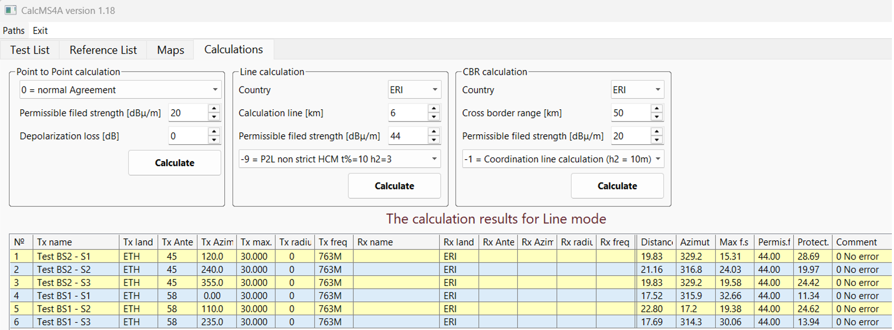

Furthermore, there is “Save to Excel” button on the bottom of the Calculations tab to save overall result to .xls file.

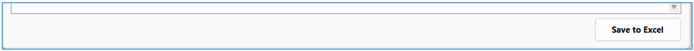

Each line of results could be also used to show more detailed calculation log for each of transmitters. It should be noted that HCM4A subroutines (similar to HCM counterpart) provides results only for worst case point on the x-km line and do not provide full details how this point has been derived.

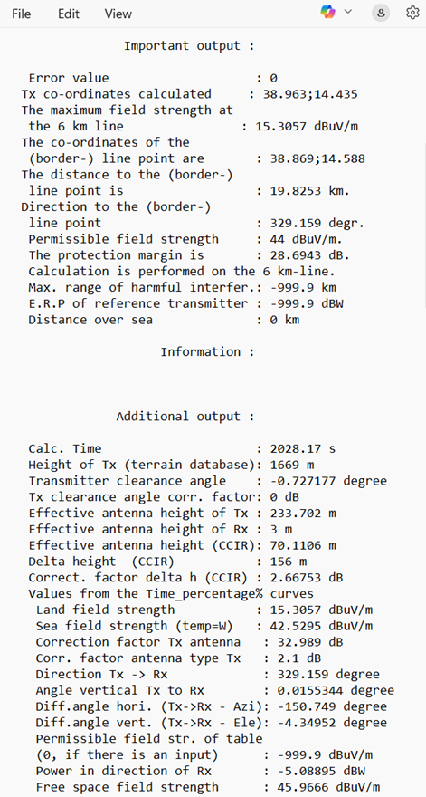

#### 2.1.3 CBR calculations
Cross-border calculations are implemented very similarly to Line calculations. Currently only Tx records are considered within the test list and no automatic conversion of receivers into equivalent transmitters is implemented. The test list contents and its visualization are shown below. As CBR calculations are more relevant to PMR/PAMR networks, examples from the Point – to Point section are reused, Test list specifically. Reference list is ignored for CBR calculations.

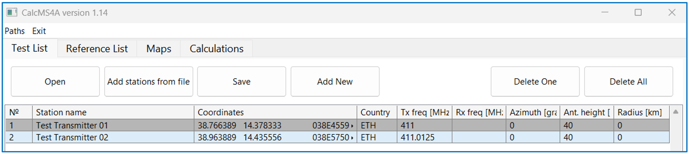

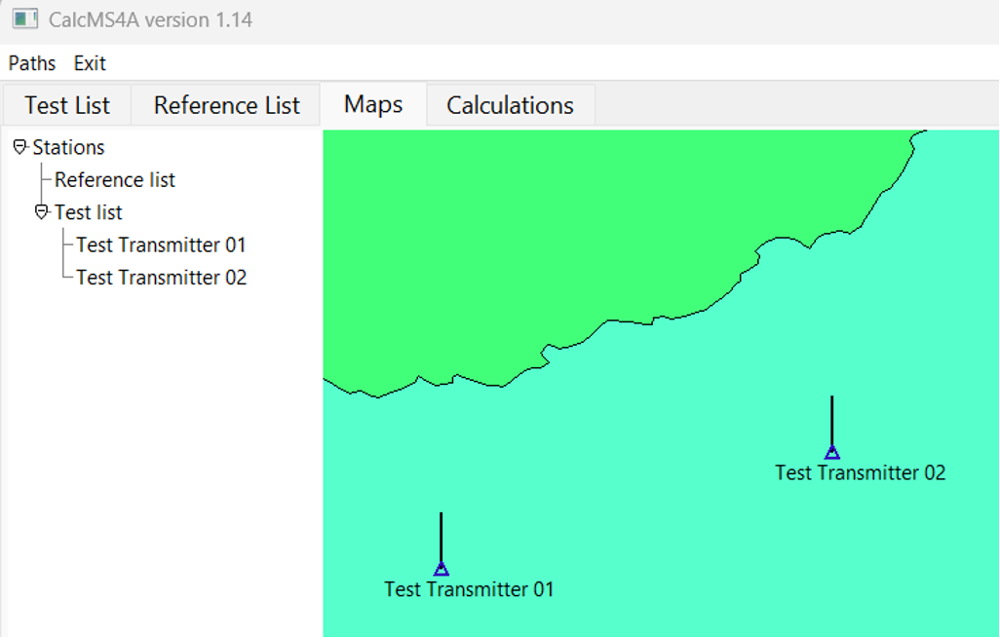

For CBR calculations one should provide the country to which interference is directed and assessed to select proper .CBR file (the segment of the border of the country sending coordination request) together with the permissible field strength (selected based on the Annex 1 of the Agreement). It should be noted that no specific corrections are prescribed to the permissible field strength for line calculations (the user should enter value taking into account any additional losses, if any). Finally, one should select an appropriate mode of calculation, usually -1 for normal HCM4A Agreement calculation. After pressing the calculation button for the CBR type calculations, the result will be provided in the table below.

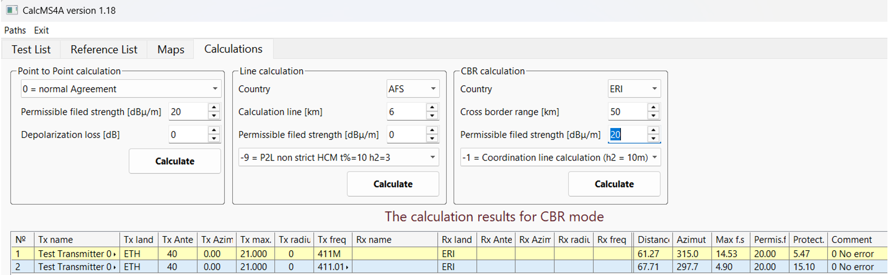

Furthermore, there is “Save to Excel” button on the bottom of the Calculations tab to save overall result to .xls file.

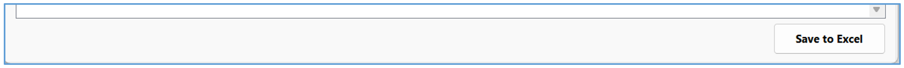

Each line of results could be also used to show more detailed calculation log for each of transmitters. It should be noted that HCM4A subroutines (similar to HCM counterpart) provides results only for worst case point among CBR generated locations and do not provide full details how this point has been derived. Even the format of the log file is the same, it reflects results for the CBR methodology.

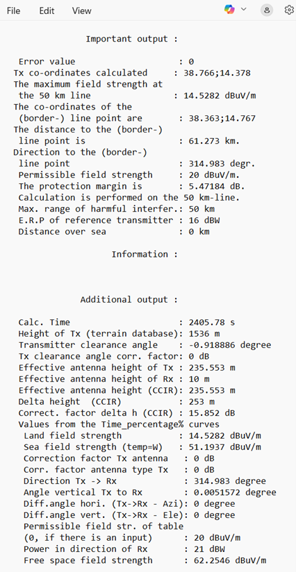

### 2.2 HCM4AMobileService OPTIONS
In order to work properly HCM4AMobileService requires several paths set correctly. The menu to set path includes three entries. All three folders are mandatory for HCM4AMobileService.

### 2.3 OPENING AND EDITING OF FILES (LISTS)
To upload station records to the test list or to the rest list the button “Open” should be used, which will open up a dialog box to find proper txt file. Txt files should be properly formatted in accordance with Annex 2A of the HCM4A Agreement. The file should also include header. The interface is similar for the Test List tab and for the Reference List tab.
To be able to create the test list or reference list from multiple files, the “Add stations from file” could be used. The difference of this button compared to the “open” button is that it doesn’t delete existing stations and it skips the header of the file (the header of the initial file is retained). The “Save” button provides functionality to save compiled list into a new file (operates as “Save as”). Buttons “Delete One” and “Delete All” operates as the name suggest. “Add new” button is used when no previous templates are present and the station needs to be entered from scratch.

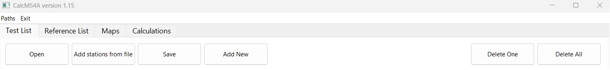

For detailed editing of separate records, one should double click the entry of specific record in the test list or in the reference list, which will open an editor for specific records either in the test list or in the reference list.

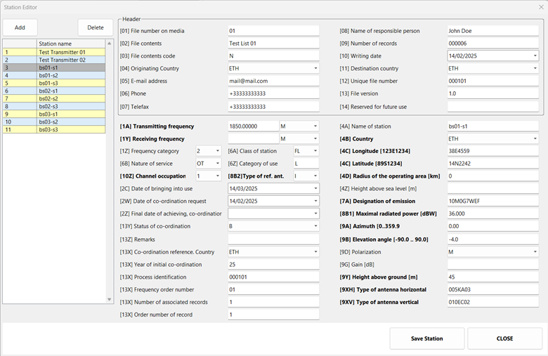

The editor provides direct access to all fields in Annex 2A format. The upper part shows the header similar to all stations in the list (but different for the test list and the reference list accordingly). The editor has to buttons of its own. The delete button operates the same way as the “Delete One” button from the list tab. The “Add” button copies the current record to the end of the list.

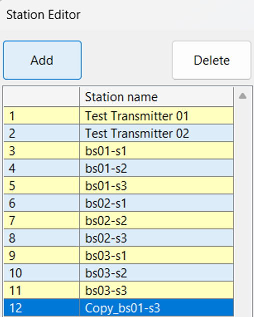

### 2.4 MAPS TAB CAPABILITIES
The “Maps” tab provides visualization of stations in the list. First of all it provides overview of locations of stations in both lists together with representation of service area (location variability of stations). The left side provides the way to center on any station in the list by clicking on its name.

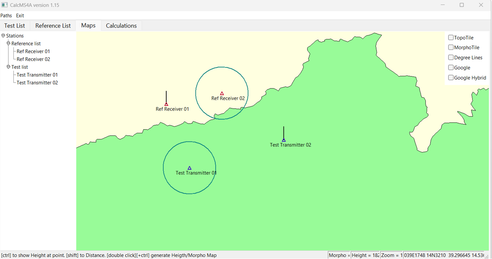

It should be noted that the map itself is color coded with PCI groups colors from bilateral/multilateral agreement across African countries (originally developed by South Africa). The overall view also provides the way to check the presents of terrain or morpho map tiles (associated files in TOPO and MORPHO folders) by check needed overlay in the upper right corner.

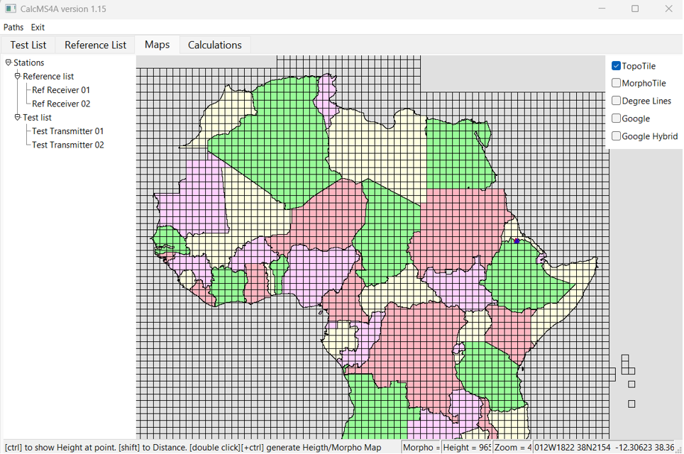

Couple of useful overlays are linked to online google maps. Especially useful might be the hybrid overlay, which also illustrates that UN based maps might not always correspond to commercial maps available online.

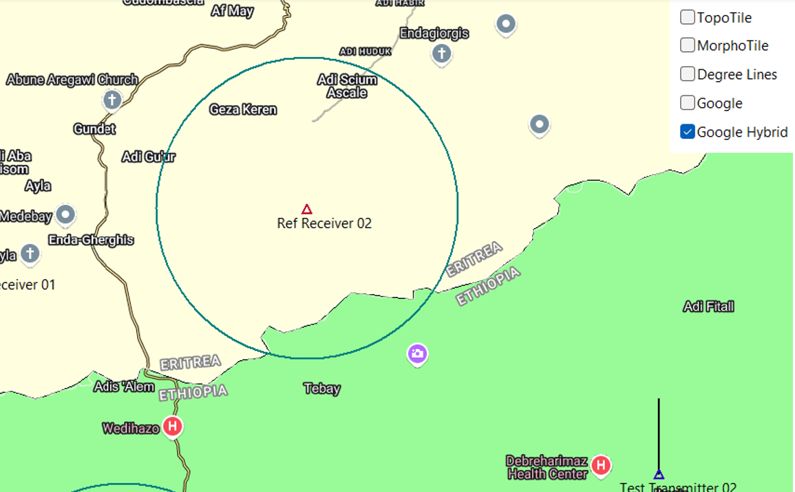

By double clicking on the map, one could visualize terrain for the central part of the map. Double clicking on the map, while pressing CTRL button will show the morphology. It is disabled for map zooming 6 or lower (to avoid very large chunks of terrain data uploads).

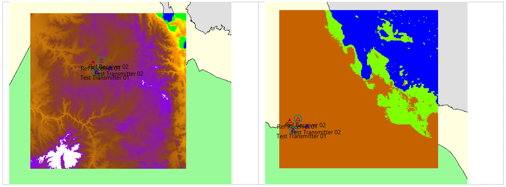

By pressing shift and clicking on the map, on could measure distances and visualize terrain profile.

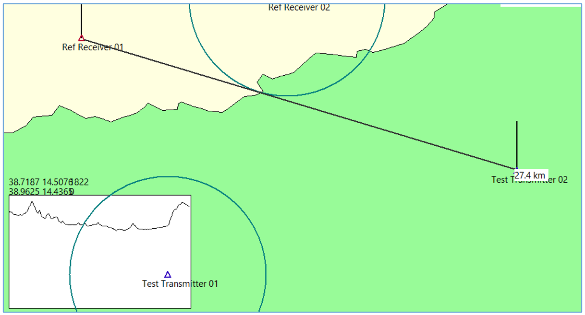

The height under any specific point could be also checked by moving cursor to this point. The indicator line at the bottom of the map provides this information.

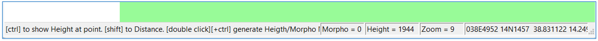

### 2.5 UPDATE OF THE GUI PROGRAM AND DLL
For simplicity of deployment the update is done by downloading updated version of the GUI program, overwriting existing files. The version of the program is reflected in the name of the main window. The version of the calculation library is shown in the detailed log of calculations.

### 2.6 INSTALLER
For simplicity of deployment the GUI program is distributed as a portable software, meaning it is enough to copy a folder with the software (and to properly set paths to topographical and morphological data) to the computer to start using it without any need for traditional installation. If required the installation setup could be created, but the software doesn’t require any specific permissions or register record to operate properly anyway.
